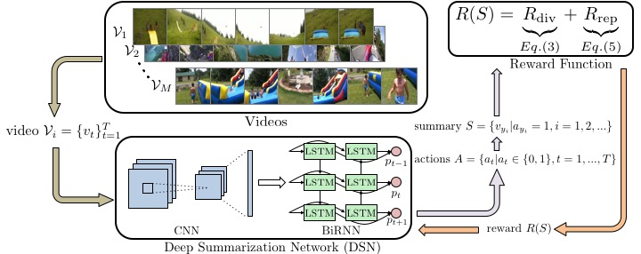

  

#### Reward=  Reward_Diversity + Reward_Representativeness.
 

######  Reward_Representativeness = Pixel Difference between two consecutive images ( MSE between them)
  
  
Changing it to  
  ###### Reward_Representativeness = SSIM between two consecutive images 
  
  Where  
  
  SSIM : structural similarity (SSIM) index 
  
  luminance (light emitted) , contrast( difference b/w luminance) , image degradation() 

## Results (Initial) : 
| Number |  Video | NewMetric | Orignal_Metric |
| ------------- | ------------- | ------------- |------------- |
| 1  | video_14  | 28.4%  |28.4%  |
| 2  | video_19  | 60.8%  |28.6%  |
| 3  | video_23  |58.3%  |61.7%  |
| 4  | video_25  |55.3%  |55.3%  |
| 5  | video_7  |29.2%  |29.1%  |

| Number |  Video | NewMetric | Orignal_Metric |
| ------------- | ------------- | ------------- |------------- |
| 1  | video_13  | 29.2%  | 50.2%  |
| 2  | video_16  | 34.9%  | 34.9%  |
| 3  | video_24  | 29.5%  | 29.5%  |
| 4  | video_3  | 35.2%  | 35.2%  |
| 5  | video_4  | 54.4%  | 47.7%  |

#### The Algorithm uses preprocessed data as its input . 
Right now , working on getting from raw data to output + into matrix that what causes these changes. 
